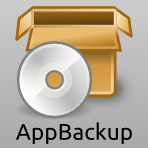
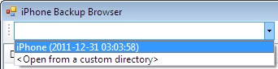
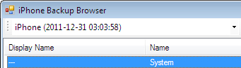
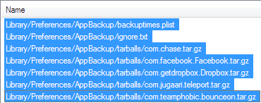
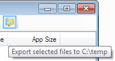

<!--[[[-->
  
<aside class="no-print"
       style="float: right; text-align: center; margin: 0.25em 0 1em 1em;">
 <section>
  
 </section>
<!--]]]--></aside>

AppBackup is an app for jailbroken iOS devices that lets you back up and
restore the saved data and settings of App Store apps.  **AppBackup DOES NOT
back up the apps themselves, just the stuff they save (like settings, game
progress, etc.)**

AppBackup is [free software][free-sw], which means that [it respects your
freedoms][free-sw].  [Its source code](#source) is freely available under
the terms of [the X11 License](#credits-and-license).

[free-sw]: https://www.gnu.org/philosophy/free-sw.html

If you want to help translate AppBackup into a different language, please see the
[Translations](#translations) section.

> {: #ios-8-notice}
> **AppBackup does not currently work on iOS 8.**
> 
> This is [being tracked as issue #6 on the bug tracker][issue-6]. 
> I have no ETA for when it will be fixed, although I do *want* to fix it.
> 
> Currently, app listing works on iOS 8, but the GUI crashes due to bad
> memory management on my part (probably because I wrote that part of the
> code when I was in high school).
> 
> The command-line interface has been updated for iOS 8.  [Instructions on
> how to install and use it can be found here.](#cli)
> 
> This page, the bug tracker, and the app's Facebook and Google+ pages
> will be updated if and when I can get it fixed.  I am very sorry for
> the problems this is causing for people.
> 
> [issue-6]: https://code.s.zeid.me/appbackup/issue/6/fix-sporadic-crashes-on-ios-8

**Compatibility Note:**  I am unable to test AppBackup on iOS 4 or later because
I only have a 2G iPhone.  However, users have reported that AppBackup does work
on iOS 7.  If you have problems, please [contact me](/contact). 
You may also try uninstalling and reinstalling AppBackup (you will not lose your
saved data in the process).

## [Download AppBackup](https://uploads.s.zeid.me/AppBackup/latest.php) {#download}

AppBackup is available via BigBoss's repository
(or [mine](/other/cydia-repository))
on Cydia!  You can find it under the Utilities section.

[You can find older versions here.](https://uploads.s.zeid.me/AppBackup/)

[Get the source code here.](#source)

## Screenshots


 

## Requirements

* A jailbroken iPhone or iPod touch running iOS 2.0 or later, with Cydia (tested
  only on iOS 3.1.2)
* At least one App Store app

## Installation

AppBackup is available via BigBoss's repo on Cydia.  You can also download and
install the Debian package directly, but you will need to make sure the
following packages are installed first:

* bash
* coreutils-bin
* python

## Usage

To back up one app, open AppBackup, select the app, and then select Backup. 
To restore an app, select it and then select Restore.  (If there is no restore
option, then it hasn't been backed up yet.)  You can also choose to delete an
app's backup, or to ignore or un-ignore the app (i.e. prevent it from being
backed up, restored, or deleted).

To back up all apps at once, tap All at the top-left of the screen, and select
Backup.  To restore all apps that have been backed up at once, tap All and
select Restore.  (You must have at least one app backed up in order to see this
option.)  You can also choose to delete all backups on your device (except those
for apps which have been ignored).

The app list only shows apps that have already been installed through the App
Store.  If you have just reset your device and you want to restore app data, then
you must first reinstall the apps whose data you want to restore before AppBackup
will let you restore their data.

## Backup location {#backup-location}

Backups are stored in `/var/mobile/Library/Preferences/``AppBackup/tarballs`
as files called `<bundle-id>.tar.gz`, where `<bundle-id>` is the respective
app's bundle identifier (e.g. `com.ooi.supermonkeyball`).  These files are
regular [gzip-compressed tar archives](https://en.wikipedia.org/wiki/Tar_%28file_format%29)
and can be opened with any program capable of viewing them (e.g. 
[7-zip](http://www.7-zip.org/) on Windows).

If you want to "back up the backups," you should back up the entire
`/var/mobile/Library/Preferences/``AppBackup` directory tree.

Backup times are stored as an XML property list at
 `/var/mobile/Library/Preferences/``AppBackup/backuptimes.plist`
as Unix timestamps. 
The list of ignored apps is stored as a plain text file at
 `/var/mobile/Library/Preferences/``AppBackup/ignore.txt`,
with each app's bundle ID on a separate line.

## FAQ

1.  **Does AppBackup back up data from jailbreak apps (e.g. from Cydia)?**
    
    No.  This is because jailbreak apps store their data in many different
    places, while App Store apps save their data in sandboxes that I can
    easily locate.  Also, the reason I made AppBackup was because, at the
    time, there was a known problem with App Store apps' data being removed
    during updates.

2.  **Does AppBackup work with iOS 4/5/6/7/14/1024?**
    
    Some users have reported that AppBackup works on iOS 4 and 5, but I can't test
    AppBackup on iOS versions greater than 3.1.3 because I only have an iPhone 2G. 
    However, if any problems are reported, I will try my best to fix them.

3.  **Does iTunes back up data that I save through AppBackup?**
    
    Yes.  AppBackup stores its data under `/var/mobile/Library/Preferences`, which
    is backed up by iTunes.

4.  **How do I get my AppBackup backups out of my backup in iTunes?**
    {: #extract-itunes-backup}
    
    For Windows:  (these instructions were tested in Windows 7 x64 Service Pack 1)
    
    1.  Install the [MS Visual C++ 2010 x86 runtime](https://www.microsoft.com/download/en/details.aspx?id=5555)
        and .NET Framework 4 ([Web installer](https://www.microsoft.com/download/en/details.aspx?id=17851)
        or [standalone](https://www.microsoft.com/download/en/details.aspx?id=17718)). 
        If you're on Windows XP, also install the [Microsoft IDN Mitigation APIs](https://www.microsoft.com/download/en/details.aspx?id=734). 
        All of these libraries are required to run the program in step 2.
    2.  Download [iPhone Backup Browser](https://code.google.com/archive/p/iphonebackupbrowser/downloads)
        (not to be confused with the non-free iPhone Backup Extractor) and
        extract it to somewhere you can remember.  It does not come with an
        installer.  This program is free software released under the revised
        BSD license.  ([Its source code is now on GitHub.](https://github.com/rene-d/iphonebackupbrowser))
    3.  Go to the folder where you extracted iPhone Backup Browser to and open
        **`iphonebackupbrowser.exe`** as an administrator (on Vista/7, right-click
        and click Run as administrator).
    4.  Click the dropdown at the top-left of the window, and select the backup
        you want to use.
        
        
        
    5.	In the top pane, click on the entry whose Display Name is `---` and whose
        Name is `System`.
        
        
        
    6.  In the bottom pane, find the entries that begin with
        "`Library/Preferences/AppBackup`".  Click on the first one, and then hold
        down the Shift key while clicking on the last one.
        
        
        
    7.  Click on the icon that looks like a folder with an arrow on it.  Its
        tooltip will say "Export selected files to C:\temp".
        
        
        
    8.  Go to `C:\temp`, then go to the folder with your device's name, then
        System &gt; Library &gt; Preferences.  The AppBackup folder contains
        AppBackup's data.  You need to copy this entire folder to
        `/var/mobile/Library/Preferences` on your iDevice in order to use it.
    
    Mac OS X instructions coming soon.

## Command-line interface {#cli}

AppBackup also has a command-line interface (which currently works with
at least iOS 2.x–8.1.x).  It is available as part of the Cydia package or
[from the Python Package Index](https://pypi.python.org/pypi/iosappbackup).

The command-line interface that comes with the Cydia package is called
`appbackup`, and the one in PyPI is called `iosappbackup`.  Currently, the
Cydia one is outdated (I'm waiting to update it in Cydia until I have the
GUI working on iOS 8, in order to avoid confusion), while the PyPI one is
the one that works on iOS 8.  In AppBackup 3, these will both be the same
thing, but the name difference will remain in order to avoid conflicts
between the two.

To install the command-line interface from PyPI on a jailbroken iOS device,
run these three commands on your device:

    $ sudo apt-get update
    $ sudo apt-get install python setuptools
    $ sudo easy_install -U iosappbackup

(The `-U` means to upgrade the package if it's already installed.)

Usage examples (only for the new `iosappbackup`):

    $ iosappbackup ls
    Chrome (com.google.chrome.ios):  (not backed up)
    Facebook (com.facebook.Facebook):  (ignored)
    Test App, Please Ignore (example.Test-App--Please-Ignore):  2014-12-19 08:56:39
    $ iosappbackup backup com.google.chrome.ios
    $ iosappbackup unignore com.facebook.Facebook
    $ iosappbackup backup --all  # or -a
    $ iosappbackup ignore com.facebook.Facebook
    $ iosappbackup restore example.Test-App--Please-Ignore
    $ iosappbackup restore --all
    $ iosappbackup ls -l
    Chrome (com.google.chrome.ios):
                Bundle name:  Chrome.app
      Bundle container path:  /var/mobile/Containers/Bundle/Application/B9DCED24-703C-4B08-B04D-3AE2EF0F6B71
      Bundle container UUID:  B9DCED24-703C-4B08-B04D-3AE2EF0F6B71
        Data container path:  /var/mobile/Containers/Data/Application/67E32582-EB57-48B0-B5F8-9C6375E71641
        Data container UUID:  67E32582-EB57-48B0-B5F8-9C6375E71641
                    Useable:  True
                    Ignored:  False
                Backup time:  2014-12-27 14:12:01
                Backup path:  /var/mobile/Library/Preferences/AppBackup/tarballs/com.google.chrome.ios.tar.gz
    
    [...]

You can also run `iosappbackup --help` or just `iosappbackup` for more help
with the command-line interface, or `iosappbackup <command> --help` for help
with a particular command.

*                         *                          *                         *

You can also install the AppBackup command-line interface on a Mac (e.g. to
use it with the iOS Simulator), or even on a non-Apple operating system such
as GNU/Linux.  To do so, first install pip if you don't have it already:

    # On a Mac (OS X comes with Python 2.7 and setuptools):
    $ sudo easy_install -U pip
    # ...or on certain Linux distributions:
    ubuntu$ sudo apt-get update; sudo apt-get install python-pip
    fedora$ sudo apt-get install python-pip
      arch$ sudo pacman -S python2-pip

Then install `iosappbackup` using `pip` (on Arch, use `pip2`):

    $ sudo pip install -U --pre iosappbackup

(As with `easy_install`, the `-U` means to upgrade the package if it's already
installed.)

(Using `pip` is recommended as it allows you to uninstall packages, whereas
`easy_install` doesn't.  On an iDevice, however, you must use `easy_install`
because `pip` doesn't work with Python 2.5.)

If you are not using `iosappbackup` on an iOS device, you will need to tell
it where your apps are with the `-r` (or `--root`) option:

    $ iosappbackup -r ~/Library/Developer/CoreSimulator/Devices/<uuid>/data ls
    $ iosappbackup -r stuffs/var-mobile backup com.mojang.minecraftpe

It will use the `Library/Preferences/AppBackup` directory inside the directory
given with `-r` as the backup and data location.  You can also use the `-c` (or
`--config-dir`) option to use a different location for the backups and data.

## Translations

I use [Transifex](https://www.transifex.com/) to manage translations for AppBackup. 
If you would like to translate AppBackup to another language, or update an existing
translation:

**NOTE:  %@ is a placeholder
for various items of text that are included at runtime.  You need to have the
%@ in the appropriate places in your translations for AppBackup to work.**  The
instructions for each string containing %@ will tell you what the %@ stands for,
although for many strings it will be obvious.

1.  Go to [https://www.transifex.com/](https://www.transifex.com/).
2.  Sign up for a free account or log in if you already have one.  (You will not
    be able to see the resource otherwise).
3.  Go to [https://www.transifex.com/projects/p/appbackup/resource/localizable-strings/](https://www.transifex.com/projects/p/appbackup/resource/localizable-strings/).
4.  Click on your language and click **Translate Now**.  If your language is not
    there, click **Add Translation**, select your language, and click
    click **Translate Online**.
5.  Update your translation and click **Save All** when you're done.

## Credits / License {#credits-and-license}

AppBackup is [free software][free-sw], which means that [it respects your
freedoms][free-sw].  [Its source code](#source) is freely available under
the terms of the X11 License.  AppBackup also includes software released
under similar free, permissive licenses.  For the full text of the license
and copyright notices for AppBackup and all software included with it, see
[the LICENSE.txt file](https://code.s.zeid.me/appbackup/src/master/LICENSE.txt)
in the source repository.

AppBackup would not have been possible without the work and help of others. 
See [CREDITS.txt](https://code.s.zeid.me/appbackup/src/master/CREDITS.txt) for
a list of these people.

[free-sw]: https://www.gnu.org/philosophy/free-sw.html

## Source Code {#source}

AppBackup's source code is available on Bitbucket at
<https://code.s.zeid.me/appbackup>.  AppBackup is written in Objective-C,
Python 2.5, POSIX shell, and C.

## Changes

### AppBackup 2.0.2 (2011-05-31) 
{: id='changes-2.0.2'}

* Fixed a bug with translations where if something wasn't translated then nothing
  would appear in the UI (expected behavior is that the English text would appear
  instead).
* AppBackup no longer crashes if backuptimes.plist is corrupted or malformed.
* Updated the Czech, Japanese, and Korean translations.

### AppBackup 2.0.1 (2011-05-27) 
{: id='changes-2.0.1'}

* Fixed the problem where AppBackup was hanging on the Please Wait screen for many
  people.
* Fixed a cosmetic bug with the Please Wait screen.
* Updated Spanish translation.
* ini-to-strings.py now sorts the list of language files before converting them.

### AppBackup 2.0 (2011-05-26) 
{: id='changes-2.0'}

* AppBackup now works on iOS versions 4.3.x and later (and it still works with
  iOS 3; untested on iOS 2).
* Added a confirmation screen for all actions.
* Redesigned About screen.
* AppBackup has been split into two parts:
   * The GUI, written in Objective-C this time.
   * A command-line interface in the form of a Python package.  (Just type
     `appbackup` at the terminal to use it.)
   * As a result, the code has been completely rewritten and is much cleaner and
     object-oriented.
* The FixPermissions utility can now be used by typing `appbackup-fix-permissions`
  at the terminal.  It is still run automatically in the GUI mode only.
* Updated translations and added new translations for the following languages:
   * Czech - Jan Kozánek
   * Chinese - goodlook8666
   * Greek - Spiros Chistoforos-Libanis
   * Japanese - Osamu
   * Korean - Joon Ki Hong
   * Norwegian - Jan Gerhard Schøpp
* Changed translations format in the source tree.
* Translations are now managed on
  [Transifex (https://www.transifex.net/)](https://www.transifex.net/)
  and converted to Apple's Localizable.strings format at build time.

### AppBackup 1.0.14 (2011-05-05) 
{: id='changes-1.0.14'}

* **SECURITY UPDATE:**
  FixPermissions now ensures that no directory other than `/var` is a link.
* Added the German ß/Eszett to the diacritical mappings used for sorting.
* This does NOT fix the incompatibility with iOS 4.3.x.  I am still working
  on fixing that.

### AppBackup 1.0.13 (2011-01-13) 
{: id='changes-1.0.13'}

* Added the ability to ignore and un-ignore apps in the backup list and when
  using the All button.
* Fixed a crash caused by an error in the Dutch translation.  (Tim van Neerbos
  was consulted about the problem string.  This bug only affected users who
  have their language set to Dutch.)
* The unique bundle ID of each app is now displayed under its name in the
  backup/restore prompt.

### AppBackup 1.0.12 (2010-11-27) 
{: id='changes-1.0.12'}

* Fixed a bug where AppBackup would crash if the modification time of a backup
  file was used instead of a non-existent backuptimes.plist entry.
* Fixed a couple of bugs in the old method of finding apps.
* Reverted to the old method of finding apps because it is faster.
* Fixed some problems with the English strings for deleting backups.
* Fixed logging when deleting backups.
* Simplified localization code in BackupAll/BackupOne.
* The action argument of `on(OneApp/AllApps)``DoAction_withModalView_` takes an
  unlocalized string now.

### AppBackup 1.0.11 (2010-11-25) 
{: id='changes-1.0.11'}

* Added a Dutch translation by Dennis Morren.
* Added a Russian translation by Nikita "ZAY" Peshkov.
* Added proper error-checking when backing up or restoring/deleting a backup.
* Added the ability to delete backups (only translated to English and Russian
  for now).
* Permissions on `/var/mobile/Library/Preferences/AppBackup` are now fixed on
  startup to reduce crashes
  
   * This is done with a setuid root binary called `FixPermissions` and can be
     disabled by making an empty file at
     `/Applications/AppBackup.app/``NoFixPermissions`

* The modification time for the backup file is now used as a fallback if the
  file exists but the app is not in backuptimes.plist.
* Added Retina images for the icon and splash screen.
  
   * The Retina icon is slightly different than the low-resolution icon.

* Re-designed the splash screen.
* Now released under the X11 License.
* The Web site's domain name is now pages.srwz.us.
* Full changelog now shipped with AppBackup and shown in the About dialog.
* Tweaked the debug.log format a tiny bit.
* Source changes:
   * Setuid root binary called `FixPermissions` added to fix permissions on startup.
   * `PermissionsFix` is now `FixPermissions.old` and is deprecated.
   * Changes related to Python naming conventions and docstrings in
    `include/globals.py`.
   * Source tree reorganized, changes and credits reorganized, and build process
     changed.
   * README and LICENSE files added.
   * Trivial changes.

### AppBackup 1.0.10 (2010-08-03) 
{: id='changes-1.0.10'}

* Added an Italian translation by Pietropaolo Mastromarco.
* Fixed a bug where the restore option didn't appear if we couldn't get a
  localized date string from the operating system, even though the app was backed
  up already.
* (Only of interest to developers) Sorted the functions in `include/globals.py`
  alphabetically, except for a couple of long ones which were left at the bottom.

### AppBackup 1.0.9.9 (2010-06-10) 
{: id='changes-1.0.9.9'}

* Added a Spanish translation by Ramón Cutanda.
* Changed the debug logging method again.
* Threads now have autorelease pools.
* This version is mainly intended to help me figure out crashing problems that
  people are having, although the above change might help some.

### AppBackup 1.0.9.2 (2010-01-14) 
{: id='changes-1.0.9.2'}

* Fixed another problem when upgrading to 1.0.7 or later from 1.0.6 or earlier.

### AppBackup 1.0.9.1 (2010-01-13) 
{: id='changes-1.0.9.1'}

* AppBackup no longer crashes on a new install.
* Fixed complications when upgrading to 1.0.7 or later from 1.0.6 or earlier.

### AppBackup 1.0.9 (2010-01-11) 
{: id='changes-1.0.9'}

* Attempted to fix AppBackup crashing on new installs.

### AppBackup 1.0.8 
{: id='changes-1.0.8'}

* There is **<u>NO</u>** version 1.0.8!

### AppBackup 1.0.7 (2010-01-10) 
{: id='changes-1.0.7'}

* Moved backup location to `/var/mobile/Library/Preferences/AppBackup`
  so that iTunes will back them up.

### AppBackup 1.0.6 (2009-09-19?) 
{: id='changes-1.0.6'}

* Added a French translation by Marc Klein and I forgot to mention it.
* Worked around a problem caused by MobileSubstrate support, which was removed.

### AppBackup 1.0.5 (2009-08-17) 
{: id='changes-1.0.5'}

* Fixed a problem where apps whose .app folders' names had non-ASCII characters
  in them (e.g. "é" or "™") would crash AppBackup.
* Support for sorting app names that have accented letters has been added. (e.g.
  "Métro" now comes before "Mint")
* CPU-intensive functions are now executed in separate threads. This should
  result in better performance.  Specifically, finding apps and the actual backup
  and restore processes are now executed in separate threads.
* The method used for finding apps has changed except for firmware versions
  below 2.1.
* Reorganized the code A LOT.
* Changed the debug logging process.
* Made other small changes.

### AppBackup 1.0.4 (2009-07-09) 
{: id='changes-1.0.4'}

* Works on iPhoneOS 3.0
* Worked around bug where an app that localized its name on the SpringBoard and
  didn't have a CFBundleDisplayName key in its Info.plist file would crash
  AppBackup
* Fixed more crash-on-startup bugs
* Added credits for the translations to the About screen (VERY sorry about not
  doing this earlier, translators)
* Added MobileSubstrate support

### AppBackup 1.0.3final (2008-09-27) 
{: id='changes-1.0.3final'}

* Added German and Swedish translations
* Uses date format according to user's locale and preferences
* Source is now compiled into optimized Python bytecode to run a little quicker;
  **this may fix some crashing problems people have been having, <em>especially
  after updating to 2.1</em>.**
* Changes to UI: All and About buttons moved to bottom; buttons in dialogs are
  now on separate rows. This is to better support translated strings.
* Sorting of apps in the list is now done case-insensitively.

### AppBackup 1.0.2 (2008-09-02) 
{: id='changes-1.0.2'}

* Fixed a problem where if an app's Info.plist file didn't exist, AppBackup
  would crash by checking to see if it exists (thanks Steven B.)
* Fixed a problem where AppBackup would crash if you have a non-directory file
  in `/var/mobile/Applications` (thanks Ryan H.)
* Changed some strings to stress that this doesn't backup the actual apps, but
  just their saved data
* **Added support for localization. If you want to help translate AppBackup into
  a different language, please [contact me](/contact}}).**
* Other small code changes

### AppBackup 1.0.1 (2008-08-19) 
{: id='changes-1.0.1'}

* Now outputs debugging info to `/var/mobile/Library/AppBackup/``debug.log`
* Fixed a problem with BigBoss-provided debs causing it to crash
* Changed something that I think might cause a crashing bug if you have lots
  of AppStore apps
* Added thanks to BigBoss for hosting it
* Some minor, unnoticeable changes (like changing some comments in the code)

### AppBackup 1.0 (2008-08-17)
{: id='changes-1.0'}

* Initial public release
