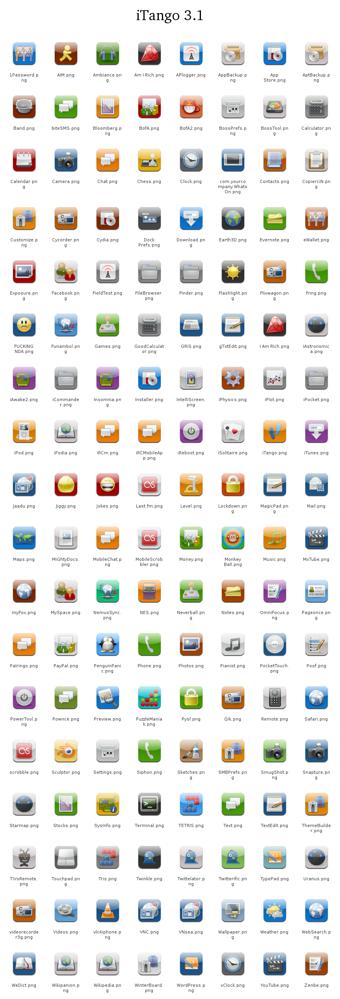

--- 
layout: page
title: iTango
stylus: |
 img:first-child + p
  margin-top: 0;
 .screenshots a
  margin-right: 1em;
  img
   height: 150px;
contents:
 Screenshots / Icons: screenshots-and-icons
 Download iTango:     download
 Requirements:        requirements
 Installation:        installation
 Supported Apps:      supported-apps
 Credits:             credits
 Changes:             changes

---

This is a WinterBoard theme for the iPhone and iPod touch that uses Tango-style
icons.

## Screenshots / Icons {#screenshots-and-icons}


 
 

## Download iTango {#download}

iTango is available on the Planet-iPhones repo via Cydia.  If you want to install
it manually, or if you want the source files:

* [Theme](http://uploads.srwz.us/iTango/iTango-3.1.zip)
* [Source files](http://uploads.srwz.us/iTango/iTango-3.1_Source.zip)
  - These require [The GIMP](http://www.gimp.org/) and include a wealth of
    standalone icons and SVGs that form the basis of this theme.
    [See below for credits.](#credits)

## Requirements

* A jailbroken iPhone or iPod touch with iPhoneOS 2.x
* WinterBoard (available through Cydia)

## Installation

iTango is available on the Planet-iPhones repo via Cydia.  If you want to install
it manually (i.e. without using Cydia):

1.  [Download iTango](http://uploads.srwz.us/iTango/iTango-3.1.zip) and extract it.
2.  Copy the `iTango` folder to `/Library/Themes` on your device. &#x2a;
3.  Open WinterBoard.
4.  Select iTango, exit, and wait for it to respring.

&#x2a; If you're on a Unix-like platform (e.g. OS X, Linux) with SSH, rsync, and
Python 2.4 or later, you can just run `install.py <your phone's IP address>`
in lieu of step 2.  This will also restart the SpringBoard in case you're
upgrading iTango.

## Supported Apps {#supported-apps}

* All built-in apps, including App Store and FieldTest (but not DemoApp)
* These 3rd-party apps:
  * 1Password
  * AIM
  * Am I Rich
  * Ambiance
  * APlogger
  * [AppBackup]({{ site.url }}/projects/appbackup)
  * Band
  * biteSMS
  * Bloomberg
  * BofA (Bank of America) (alternate "Evil" version available)
  * BossPrefs
  * BossTool
  * Chess
  * Customize
  * Cycorder
  * Cydia
  * Dock Prefs (settings app for Dock)
  * Earth3D
  * Evernote
  * eWallet
  * Exposure
  * Facebook
  * FieldTest
  * FileBrowser
  * Finder
  * Flashlight
  * Flixwagon
  * fring
  * FUCKING NDA
  * Funambol
  * GoodCalculator
  * GRiS
  * gTxtEdit
  * HistoryDL
  * I Am Rich
  * iAstronomica
  * iAwake2
  * iCommander
  * Insomnia
  * Installer
  * IntelliScreen
  * iPhysics
  * iPlot
  * [iPodia](http://keishi.net/ipodia/) (Web clip)
  * iRCm
  * iReboot
  * iSolitaire
  * iTango (Web clip)
  * Jaadu/Jaadu Click
  * Jiggy
  * Jokes
  * Last.fm
  * Level
  * Lockdown
  * MagicPad
  * MiGhtyDocs
  * MobileChat
  * MobileScrobbler
  * Mocha VNC/Mocha VNC Lite
  * Money
  * Monkey Ball
  * MySpace
  * MxTube
  * NemusSync
  * NES
  * Neverball
  * OmniFocus
  * PageOnce
  * Palringo
  * PayPal
  * PenguinPanic
  * Pianist
  * PocketTouch
  * Poof
  * PowerTool
  * Pownce
  * Preview
  * PuzzleManiak
  * Pysl
  * Qik
  * Remote
  * scrobble
  * Sculptor
  * Siphon
  * Sketches
  * SmugShot
  * Snapture
  * Starmap
  * SysInfo
  * Terminal
  * TextEdit
  * TETRIS
  * ThemeBuilder
  * TiVoRemote
  * Touchpad Pro
  * Tris
  * Twinkle
  * Twittelator
  * Twitterific
  * TypePad
  * Uranus
  * videorecorder3g
  * vlc4iphone
  * VNsea
  * Wallpaper
  * WebSearch
  * WeDict
  * Wikipanion
  * Wikipedia (Web clip)
  * WinterBoard
  * WordPress
  * xClock
  * Zenbe

## Credits

Most of these icons come from a custom Gnome icon theme based on Foxtrot created with
[Tango Generator](http://mejogid.ohallwebservices.com/site/index.php?q=node/1),
but the real credit for a lot of them goes to the Tango Desktop Project.
PenguinPanic's icon comes from Crystal SVG, and TiVoRemote's icon comes from
hicolor's icon for gnome-lirc-properties.  I created the PocketTouch icon from
the iPod icon from the Foxtrot-based theme.  The icons for Twitter clients are
based on the [Pidgin](https://www.pidgin.im/) icon.

Most of the icon backgrounds were made by me.  The source files are based from
Jotlet's PSD file from their blog a long time ago, but I have replaced almost
everything in it, so only a few background layers are even based on theirs.
The glossy overlay, shadow, and layer mask all come from the PNGs that
MobileSafari uses to make Web clips, and credit for them goes to Apple.

The wallpaper comes from
[here](https://www.gnome-look.org/content/show.php/tango+wallpaper?content=31007)
and is released under a Creative Commons Attribution-ShareAlike license.

Tango icons are © Tango Desktop Project and are released under the
[Creative Commons Attribution Share-Alike license](https://creativecommons.org/licenses/by-sa/2.5/).

## Changes

### iTango Version 3.1 (2008-09-16)

* Added:  AptBackup, CopierciN, iRCMobileApp, and myFox
* Changed:  Last.fm, MobileScrobbler, scrobble, and TiVoRemote
* Calendar icon date tweaked for new version of WinterBoard (be sure to update
  WinterBoard)

### iTango Version 3.0 (2008-08-31)

* Added:  Ambiance, `F***ING NDA` (actual icon name is uncensored), iPodia
  (Web clip), iReboot, iTango (Web clip), Jaadu/Jaadu Click, Last.fm, Mocha
  VNC/Mocha VNC Lite, Wikipedia, and Wikipanion
* Changed:  Calendar, PowerTool, and TiVoRemote
* Changed backgrounds a little bit as follows:
  * Now has separate backgrounds for SpringBoard and lock screen
  * Both have the Tango logo sitting on top of the dock/slider bar respectively
* Calendar icon now shows the current date
* No longer needs a MobileCal plist patch to look right
* Planet-iPhones package no longer depends on BossPrefs MobileCal Patch
* _**Be sure to update WinterBoard and undo MobileCal plist patches for best
  results!!!!!**_

### iTango Version 2.2 (2008-08-24)

* Added:  Cycorder, Flixwagon, MagicPad, Pysl, Qik, and videorecorder3g
* Changed theme folder back to just `iTango` to be consistent with the
  Planet-iPhones package.

### iTango Version 2.1 (2008-08-19)

* Added:  [AppBackup]({{ site.url }}/projects/appbackup) (redundant, I know, since
  it's my own app), Dock Prefs, Exposure, GRiS, MobileChat, and scrobble
* Changed:  Finder, FileBrowser, iCommander, and iPocket
* An `F***ING NDA` icon can be found under the `Dev` folder in the source package
  as `fing_nda.png`.
* This is the first version to be available in Planet-iPhones' Cydia repo, along
  with a MobileCal Patch add-on for BossPrefs that I wrote.  :D

### iTango Version 2.0 (2008-08-12)

* Added: MiGhtyDocs, Bloomberg, Sketches, BossTool, Lockdown, I Am Rich, Am I Rich,
  Earth3D, biteSMS, and vlc4iphone
* Changed (general): Poof, IntelliScreen, PocketTouch, BofA2 (alternate BofA icon),
  and TiVoRemote
* Changed red background: Calendar, Jiggy, and MobileScrobbler
* Changed purple background: OmniFocus, PowerTool, Insomnia, and iTunes
* Changed green background: Text, Money, Neverball, Games, Siphon, Phone, fring,
  and Stocks
* Changed black background: Terminal, Twinkle, and Flashlight
* Added a shadow to undocked icon texts in case you're using a whiteish background.
  (Be sure to update WinterBoard!)
* Changed the theme folder name to `iTango.theme` to follow new WinterBoard naming
  style

### iTango Version 1.0 (2008-08-06)

* Renamed to iTango
* Reset version number to 1.0
* New wallpaper
* New translucent dock

### iTrot Version 5 (2008-08-04)

* Fixed AppStore app icons to work with latest version of WinterBoard
* Changed background for Facebook and MySpace

### iTrot Version 4 (2008-08-04)

* Made Cydia's background a little darker
* Added support for Twittelator, AIM, Twinkle, Pownce, Twitterific, MySpace,
  Facebook, TypePad, Palringo, and Jokes

### iTrot Version 3.1 (2008-08-03)

* Added support for iRCm
* Source file remains unchanged

### iTrot Version 3 (2008-08-03)

* Support for iAstronomica, Starmap, and Uranus
* Better support for Band on 2.0
* New backgrounds for Cydia and WinterBoard
* Fixed minor cosmetic issues with Remote and WordPress
* Added a semi-transparent dock (WinterBoard users should update WinterBoard for
  best results)

### iTrot Verison 2 (2008-08-02)

* Support for WordPress, Remote, SmugShot, PayPal, BofA, TETRIS, eWallet,
  1Password, OmniFocus, and WeDict

### iTrot Version 1 (2008-08-02)

* Initial public release
