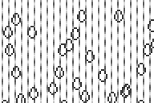

--- 
layout: page
title:  Rain Animation
icon:   icon.png
stylus: |
 @media screen
  .no-screen
   display: none;
---

<aside style="float: right; text-align: center; margin: 0.25em 0 1em 1em;">
 <iframe id="rain" src="http://ti-rain.s.zeid.me/#embed" class="no-print"
         style="width: 192px; height: 128px; border: none; background: transparent;">
  
 </iframe>
 
</aside>

This TI-83+/84+ program is an animation of rain as viewed from
[behind a window](https://www.youtube.com/watch?v=Ubsxc77YPCs "I'm taking this song out of context a bit; Ludovico says that “[i]t describes the moment when you are looking through a window and you *see something happening outside that grabs your attention*” \(emphasis mine\), as opposed to just watching the rain."){: style="color: inherit;"},
written in Axe.
{: style="margin-top: 0;"}

## [Download and Info Page on ticalc.org](http://www.ticalc.org/archives/files/fileinfo/429/42946.html) {#download}

## Web-based Version {#web}

A Web-based version of this animation is available at
[ti-rain.s.zeid.me](//ti-rain.s.zeid.me/).&nbsp; It requires a recent Web
browser, such as Firefox or Google Chrome, that supports the HTML 5 Canvas
element.&nbsp; It may also work in Internet Explorer 7 or later; however, I have only
tested it in Google Chrome at the time of this writing.

## Installation and Running Rain {#installation}

The recommended way to run Rain is to send it to your calculator with TI-Connect
(Windows) or TILP (Windows/OS X/Linux), archive it, install CalcUtil, and run it
straight from the PRGM menu while archived.&nbsp; You can also run it using a
shell like Ion or MirageOS, or use the Asm( command under `2nd+[CATALOG]`, as long
as it's not archived.

If you want to use CalcUtil, it may be found at
[http://www.ticalc.org/archives/files/fileinfo/400/40029.html](http://www.ticalc.org/archives/files/fileinfo/400/40029.html).

Please note that these programs have been tested on a TI-84+ SE calculator running
TI-OS version 2.43, with and without CalcUtil.

RAIN is compiled for Ion; however it doesn't use any Ion-specific functions.&nbsp;
You do not need any shell or no-shell program installed to use it.

## Usage

Once started, no further user action is needed to watch the rain.&nbsp;
However, certain buttons will do things:

<table>
 <tr>
  <td><strong>CLEAR</strong></td>
  <td>Exits the animation.</td>
 </tr>
 <tr>
  <td><strong>STO&gt;</strong></td>
  <td>Exits the animation, restoring the raindrops' positions when run next.</td>
 </tr>
 <tr>
  <td><strong>ENTER</strong></td>
  <td>Pauses the animation.&nbsp; Press any key to resume the animation.</td>
 </tr>
 <tr>
  <td><strong>MODE</strong></td>
  <td>Switches between fast and slow mode on 15 MHz calculators.</td>
 </tr>
 <tr>
  <td><strong>DEL</strong></td>
  <td>
   Toggles debug mode (certain state variables being displayed in the top-left
   corner.
  </td>
 </tr>
 <tr>
  <td><strong>Y=</strong></td>
  <td>Shows the About screen.&nbsp; Press any key to return to the animation.</td>
 </tr>
</table>

Fast mode, debug mode, and the raindrops' positions are stored in the RAINSAVE
application variable upon exiting.  If CLEAR or STO&gt; was pressed, the fast mode
and debug mode settings will be restored the next time prgmRAIN is run.&nbsp; If
STO&gt; was pressed, the raindrops' positions will also be restored.&nbsp; The
RAINSAVE variable is NOT archived, and it will be UNarchived if necessary.

## Debug Mode Key {#debug-mode-key}

<table>
 <tr>
  <td><strong>T</strong></td>
  <td>Timer</td>
 </tr>
 <tr>
  <td><strong>N</strong></td>
  <td>Which raindrop is up for (re)drawing.</td>
 </tr>
 <tr>
  <td><strong>I</strong></td>
  <td>0 if all raindrops have been drawn at least once, 1 otherwise</td>
 </tr>
 <tr>
  <td><strong>F</strong></td>
  <td>
   Fast mode enabled?&nbsp; 0 if disabled, 257 if enabled (at least on my
   calculator)
  </td>
 </tr>
</table>

## Debugger Usage {#debugger}

RAINDBG shows all 210 bytes of RAINSAVE, up to 7 at a time, for your
enjoyment.`[dubious claim]`&nbsp; The 8 variables (B, D, F, I, N, R, S, and T)
representing the program state are displayed first, then two padding bytes, then
100 bytes (GDB0) that store the X coordinates + 5 for each raindrop, and finally
the 100 bytes (GDB1) that store the Y coordinates + 3 for each raindrop.&nbsp;
The variable's memory address (in base 10) is displayed at the top of the first
page.

To scroll, use the up and down buttons (any other button except ON and CLEAR will
also scroll down).&nbsp; To exit the debugger, press CLEAR.

### Variables not listed under Debug Mode Key {#more-debug-variables}

<table>
 <tr>
  <td><strong>B</strong></td>
  <td>Background sprite number (0-7)</td>
 </tr>
 <tr>
  <td><strong>D</strong></td>
  <td>Debug mode enabled? (0, 1)</td>
 </tr>
 <tr>
  <td><strong>R</strong></td>
  <td>Number of raindrops (35)</td>
 </tr>
 <tr>
  <td><strong>S</strong></td>
  <td>
   Whether raindrop coordinates will be restored on restart (was STO&gt; pressed)
   (0, 1)
  </td>
 </tr>
</table>

## Source Code {#source}

RAIN and RAINDBG are written in Axe 0.2.5.&nbsp; The source code for these
programs are respectively located in RAINSRC and RAINDSRC and can be edited in
the TI-BASIC editor.&nbsp; To compile them, you will need Axe Parser 0.2.5 on
your calculator.&nbsp; I have not tested these programs when compiled with Axe
Parser versions later than 0.2.5.

The source code is also available in plain text files viewable on a
computer.&nbsp; If the arrows, greater-than-or-equal-to signs, etc. don't display
properly, make sure your text editor/viewer/Web browser is set to display the
files in UTF-8 (Unicode) encoding.
